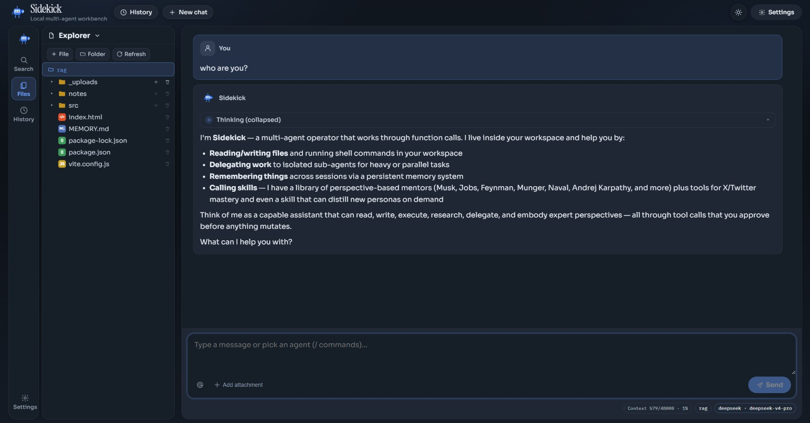
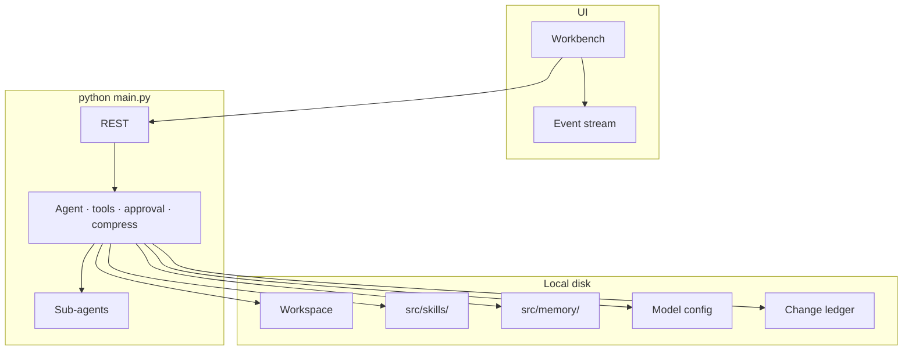

# Sidekick — Local multi-agent workbench

[中文](README.md) · English

One workspace. A main agent plans; sub-agents execute.  
Every AI edit can be approved, audited, undone, and replayed.

**Windows · macOS · Linux** · default **http://127.0.0.1:8787**

---

## Overview

Sidekick is not a chat box. It is a local collaboration team: open any folder, let the main agent break down the work, and let sub-agents search, read, and edit files. Writes, deletes, and shell commands pause for your confirmation by default.

The web workbench and the desktop app share one turn loop, so tool dispatch, approvals, compression, and the agent board behave the same. Skills drop in as directories. Memory stays on disk. Models use your own compatible endpoint (base URL + API key + model name).

---

## Screenshots

<p align="center">
  
</p>
<p align="center">
  
</p>

---

## Installation

Sidekick runs on Windows, macOS, and Linux. Pick the path that matches your use case.

| Path | Audience | When to use |
| --- | --- | --- |
| [Quick start](#quick-start) **(recommended)** | Everyday use | Python is already on the machine |
| [Desktop app](#desktop-app) | Live page preview and element pick | Double-click the launcher |
| [Develop from source](#develop-from-source) | UI, tools, or Skills | Backend plus UI hot reload |
| [Windows offline installer](#windows-offline-installer) | Machines without a toolchain | Build on a networked PC, copy the Setup exe |

### Prerequisites

| Requirement | Quick start | Desktop app | Develop from source | Offline installer |
| --- | :---: | :---: | :---: | :---: |
| Python 3.10+ | required | required | required | on the build PC |
| Node.js 18+ | — | handled by the script | required to change the UI | on the build PC |

### Quick start

**Windows PowerShell**

```powershell
cd path\to\Sidekick
python -m pip install -r requirements.txt
python main.py
```

Or double-click **`start.bat`** (no `PYTHONPATH` needed).

**macOS / Linux**

```bash
cd /path/to/Sidekick
python3 -m pip install -r requirements.txt
python3 main.py
```

Open **http://127.0.0.1:8787** → pick a workspace folder → Settings → Model → paste a compatible base URL, API key, and model name.

You can also copy `src/data/model.json.example` → `src/data/model.json` and edit it.

> [!NOTE]
> Never commit real keys, `.env`, sessions, or `model.json` (see `.gitignore`).

### Desktop app

The desktop window is the usual daily path: a sidebar can preview local pages, with interaction and element pick.

Double-click **`start-desktop.bat`** to install dependencies and launch.

```powershell
.\start-desktop.bat
```

The browser sandbox needs Chromium once:

```bash
pip install playwright
playwright install chromium
```

See [docs/browser-sandbox.md](docs/browser-sandbox.md).

### Develop from source

When you are changing the UI, run the backend and the frontend separately:

```powershell
python main.py
```

```powershell
cd ui
npm i
npm run dev          # HMR
# npm run build      # then the backend can serve the static build
```

### Windows offline installer

Build once on an online Windows PC, then copy the Setup exe:

```powershell
.\scripts\build-windows.bat
```

See [packaging/windows/README.md](packaging/windows/README.md).

---

## Configuration

### First-run setup

1. Choose a local workspace folder (code, docs, logs).
2. In Settings, configure the main, sub-agent, and compress models (they may use different endpoints or price tiers).
3. Install Chromium if you need the browser sandbox (see above).

The main model handles chat and planning. Sub-agents take delegated work. The compress model summarizes when the context fills. Keys live in local `model.json` and are encrypted at rest.

### Local security (defaults)

- Binds `127.0.0.1` only; non-loopback bind requires `META_ALLOW_REMOTE=1` (unsafe).
- The API requires a local token; the UI fetches it via `/api/bootstrap`.
- API keys in `model.json` are encrypted at rest.
- Shell tools are on by default and still go through the approval gate; set `META_ALLOW_SHELL=0` to disable.

### Run

```powershell
python main.py                 # foreground, 127.0.0.1:8787
.\start.bat                    # Windows one-shot
.\start-desktop.bat            # desktop window
```

Open **http://127.0.0.1:8787**. Press `Ctrl+C` to stop a foreground process.

Slash commands: `/help` · `/new` · `/clear` · `/skills` · `/skill <name>` · `/memory` · `/history` · `/browser` · `/stop`

---

## Key features

| Capability | What it does |
| --- | --- |
| **Multi-agent collaboration** | The main agent plans and delegates. Sub-agents search, read, and edit. Multi-party sessions appear as characters on a board; messages pass between them; click a figure for details. |
| **Change ledger** | Mutating tools wait for approval. The timeline records who (main or sub) changed which file and why. Undo by turn or by file; replay a plan from a confirmation point. |
| **Workspace-native files** | Open a local folder and chat. Create / rename / delete (confirm) / drag-move. Search by name and content, then jump to the line. |
| **Drop-in Skills** | Put a folder in `src/skills/` and call it with `/skill <name>`. No core-code change. |
| **Persistent memory** | A category library. Choose which notes inject on the next turn. |
| **Context compression** | Compress when the window fills. Skills load on demand instead of pasting a giant prompt every turn. Heavy work can use a stronger model; delegation and compression can use cheaper ones. |
| **Approvals and safety** | Writes, deletes, shell, and memory updates pause for a decision. Default listen address is loopback only. |
| **Browser sandbox** | Preview local sites; Select Mode sends an element into chat; agents can call `browser_*` tools. |
| **Sessions and replay** | Streaming chat, attachments, stop, edit & resend (optionally restore files to that step). Paginated history; Chinese / English; light / dark. |

---

## Architecture



```
Sidekick/
├── src/metateam/     # core: API, agents, tools
├── src/skills/       # drop-in Skills
├── src/memory/       # memory library (user notes not committed)
├── src/data/         # model.json.example (no secrets)
├── src/sessions/     # sessions (local, not committed)
├── src/workspace/    # default workspace placeholder
├── ui/               # control UI
├── desktop/          # desktop shell
├── packaging/windows/# offline installer notes
├── scripts/
├── docs/
├── main.py
├── start.bat
├── start-desktop.bat
├── requirements.txt
├── README.md
└── README.en.md
```

---

## Extending

- **Add a Skill** — drop a folder into `src/skills/`, invoke with `/skill <name>`
- **Add a tool** — register a function under `src/metateam/runtime/tools/`
- **Restyle** — `ui/src/` and `ui/src/styles/app.css` (no backend change)
- **Connect a model** — any compatible endpoint (base URL + API key + model name)

Bug reports, ideas, docs, and runtime patches are welcome.
