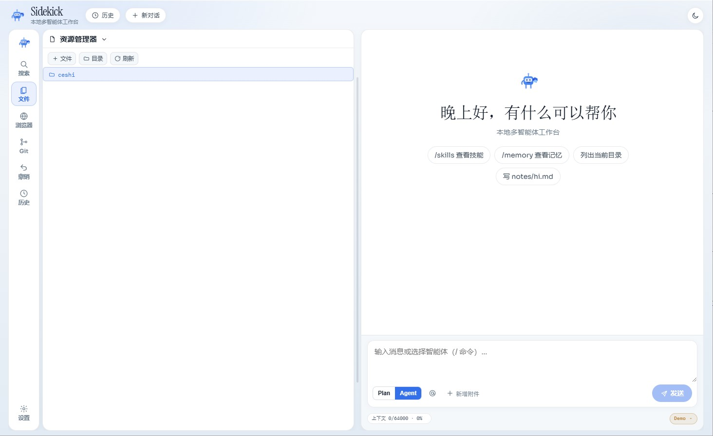
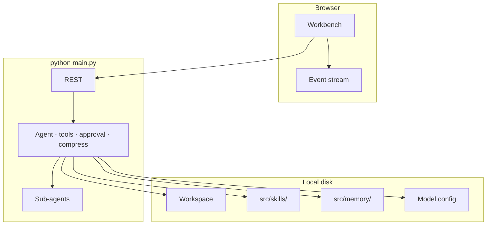

# Sidekick

[中文](README.md) · English

**Sidekick** is an open-source **local multi-agent platform**.
Open a folder, chat in the browser, and let a main agent plus sub-agents search and edit files — with human approval. Drop in Skills, keep a tagged Memory library.

Built to be **forked**: clear Python + Vite layers. Add a Skill or register a tool and you have a private workbench, without fighting a black box.

**Windows · macOS · Linux** · default **http://127.0.0.1:8787**

---

## Screenshots



---

## Why fork this

**Fork-friendly**  
`src/metateam/` is the runtime (API, agents, tools). `ui/` is the control interface. Skills, Memory, and model config are separate layers — ship a private fork by restyling the UI or adding tools.

Typical customizations:

- **Add a Skill** — drop a folder into `src/skills/`, invoke with `/skill <name>`
- **Add a tool** — register a function in `src/metateam/runtime/tools.py`
- **Restyle** — `ui/src/` and `ui/src/styles/app.css` (no backend change)
- **Connect a model** — any OpenAI-compatible gateway (base URL + API key + model name)

**Token-efficient**  
Compress when the context fills. Skills are callable tools, not giant prompts pasted every turn. Point heavy work at a strong model and delegation / compression at cheaper ones.

**Workspace-native**  
Content search, streaming chat, and a detail panel in one UI. Mutating actions (write, delete, shell, memory) ask for approval first.

**Yours**  
Runs locally. Bring your own API key (any OpenAI-compatible endpoint). History, Memory, and workspace stay on disk you control.

---

## Capabilities

| | |
|---|---|
| **Chat + tools** | SSE streaming, attachments, stop cleanly, edit & resend (optionally restore files to that step) |
| **Files** | Create / rename / delete (confirm) / drag-move; search by name **and** content with line jump |
| **Browser sandbox** | Preview local sites; Select Mode → chat; agent `browser_*` tools |
| **Memory** | Category library; toggle which notes inject on the next turn |
| **Skills** | Drop packs under `src/skills/`, invoke with `/skill <name>` |
| **Models** | Any OpenAI-compatible API; separate main, sub-agent, and compress models |
| **UI** | Chinese / English · light / dark · paginated history |

### Slash commands

`/help` · `/new` · `/clear` · `/skills` · `/skill <name>` · `/memory` · `/history` · `/browser` · `/stop`

Browser sandbox needs Playwright Chromium once:

```bash
pip install playwright
playwright install chromium
```

See [docs/browser-sandbox.md](docs/browser-sandbox.md).

---

## Quick start

**Requirements:** Python 3.10+ · Node.js 18+ (UI only)

### Windows PowerShell

```powershell
cd path\to\Sidekick
python -m pip install -r requirements.txt
python main.py
```

Or double-click **`start.bat`** (no `PYTHONPATH` needed).

### macOS / Linux

```bash
cd /path/to/Sidekick
python3 -m pip install -r requirements.txt
python3 main.py
```

Open **http://127.0.0.1:8787** → pick a workspace folder → Settings → Model → paste an OpenAI-compatible base URL and API key.

### Desktop app

Double-click **`start-desktop.bat`** to install deps and launch Electron with a live preview sidebar.

```powershell
.\start-desktop.bat
```

See [desktop/README.md](desktop/README.md) · [docs/browser-sandbox.md](docs/browser-sandbox.md).

### Windows offline installer (.exe)

Build once on an online Windows PC, then copy the Setup exe:

```powershell
.\scripts\build-windows.bat
```

See [packaging/windows/README.md](packaging/windows/README.md).

> Never commit real keys, `.env`, sessions, or `model.json` (see `.gitignore`).

### Local security (defaults)

- Binds `127.0.0.1` only; non-loopback bind requires `META_ALLOW_REMOTE=1` (unsafe).
- API requires a local token; the UI fetches it via `/api/bootstrap`.
- API keys in `model.json` are encrypted at rest.
- Shell tools are on by default and still go through the approval gate; set `META_ALLOW_SHELL=0` to disable.

### UI (optional)

```powershell
cd ui
npm i
npm run dev          # HMR
# npm run build      # then backend can serve the static build
```

---

## Architecture



```
Sidekick/
├── src/metateam/     # core: API, agents, tools
├── src/skills/       # drop-in Skills
├── src/memory/       # memory library (user notes not committed)
├── src/data/         # model.json.example (no secrets)
├── src/sessions/     # sessions (local, not committed)
├── src/workspace/    # default workspace placeholder
├── ui/               # Vite control UI
├── desktop/          # Electron shell
├── packaging/windows/# offline installer notes
├── scripts/
├── docs/
├── main.py
├── start.bat
├── start-desktop.bat
├── requirements.txt
├── README.md
└── README.en.md
```

Fork it, restyle it, add Skills — make it your own multi-agent workbench.
