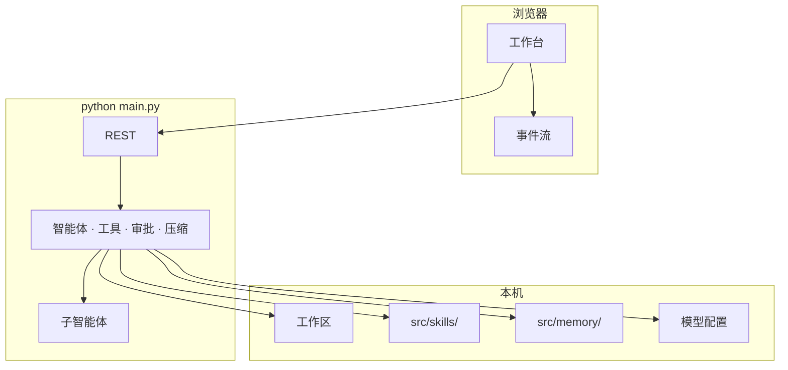

# Sidekick

[English](README.en.md) · 中文

**Sidekick** 是开源的**本机多智能体平台**。打开本地文件夹即可对话：主智能体与子智能体协作搜索、编辑文件，写入前会征求确认。Skills 可直接丢进目录，Memory 可按分类长期保存。

定位很简单：**方便二开**。Python 后端 + Vite 前端分层清楚，加一个 Skill 或注册一条工具就能做成自己的私有版，不必改核心黑盒。

**Windows · macOS · Linux** · 默认 **http://127.0.0.1:8787**

---

## 界面预览


---

## 为什么开源这份代码

**方便二开**  
`src/metateam/` 是运行时（API、智能体、工具），`ui/` 是控制界面。Skills、Memory、模型配置彼此独立——拷走仓库、换皮肤、加工具即可私有化。

二开入口很短：

- **加 Skill**：把目录丢进 `src/skills/`，对话里用 `/skill 名称` 调用
- **加工具**：在 `src/metateam/runtime/tools.py` 注册函数即可被智能体调用
- **改界面**：`ui/src/`，样式在 `ui/src/styles/app.css`（不必改后端）
- **接模型**：任意 OpenAI 兼容网关（Base URL + API Key + 模型名）

**Token 更省**  
上下文将满时自动压缩。Skills 按需调用，而不是每轮把长流程塞进 prompt。主模型 / 子模型 / 压缩模型可分开配置。

**贴着工作区干活**  
文件名与内容搜索、流式对话、详情面板一体。写入、删除、Shell、记忆变更会先征求批准。

**数据在你这边**  
本机运行，自备 API Key。历史、Memory、工作区文件都在你控制的磁盘上。

---

## 能力一览

| | |
|---|---|
| **对话 + 工具** | SSE 流式、附件、干净停止、编辑重发（可选恢复文件到该步） |
| **文件** | 新建 / 重命名 / 删除确认 / 拖拽移动；按文件名**与**内容搜索并跳行 |
| **浏览器沙盒** | 预览本地站、点选 DOM 发给智能体；智能体可用 browser_* 工具验收 |
| **Memory** | 分类记忆库：开关控制哪些条目注入下一轮对话 |
| **Skills** | 放到 `src/skills/`，`/skill <名称>` 调用 |
| **模型** | 任意 OpenAI 兼容接口；主模型 / 子模型 / 压缩模型可分开配置 |
| **界面** | 中 / 英 · 浅 / 暗色 · 历史分页 |

### 斜杠命令

`/help` · `/new` · `/clear` · `/skills` · `/skill <名称>` · `/memory` · `/history` · `/browser` · `/stop`

浏览器沙盒依赖 Playwright Chromium（一次性）：

```bash
pip install playwright
playwright install chromium
```

详见 [docs/browser-sandbox.md](docs/browser-sandbox.md)。

---

## 快速开始

**环境：** Python 3.10+ · Node.js 18+（仅 UI 需要）

### Windows PowerShell

```powershell
cd path\to\Sidekick
python -m pip install -r requirements.txt
python main.py
```

或双击 **`start.bat`**（无需设置 `PYTHONPATH`）。

### macOS / Linux

```bash
cd /path/to/Sidekick
python3 -m pip install -r requirements.txt
python3 main.py
```

打开 **http://127.0.0.1:8787** → 选工作区文件夹 → 设置 → 模型 → 填入兼容 OpenAI 的 Base URL 与 API Key。

也可复制 `src/data/model.json.example` → `src/data/model.json`。

### 桌面应用

日常使用推荐桌面端：侧栏可预览本地页面，支持交互与点选。

双击 **`start-desktop.bat`** 会自动安装依赖并启动 Electron。

```powershell
.\start-desktop.bat
```

详见 [desktop/README.md](desktop/README.md) · [docs/browser-sandbox.md](docs/browser-sandbox.md)。

### Windows 离线安装包（.exe）

在一台能联网的 Windows 开发机上打包，再把安装程序拷到目标机：

```powershell
.\scripts\build-windows.bat
```

详见 [packaging/windows/README.md](packaging/windows/README.md)。

> 切勿提交真实 Key、`.env`、会话或 `model.json`（见 `.gitignore`）。

### 本机安全（默认）

- 仅绑定 `127.0.0.1`；非本机绑定需显式 `META_ALLOW_REMOTE=1`（不安全）。
- API 需本地令牌；UI 经 `/api/bootstrap` 自动获取。
- `model.json` 中的 API Key 使用本机密钥加密存储。
- Shell 工具默认开启，仍走审批门；设 `META_ALLOW_SHELL=0` 可完全关闭。

### UI（可选）

```powershell
cd ui
npm i
npm run dev          # 热更新
# npm run build      # 构建后只跑后端即可托管静态页
```

---

## 架构



```
Sidekick/
├── src/metateam/     # 核心：API、智能体、工具
├── src/skills/       # 可丢入的 Skills
├── src/memory/       # 记忆库（本地，不提交用户内容）
├── src/data/         # model.json.example（无密钥）
├── src/sessions/     # 会话（本地，不提交）
├── src/workspace/    # 默认工作区占位
├── ui/               # Vite 控制界面
├── desktop/          # Electron 桌面端
├── packaging/windows/# 离线安装包说明
├── scripts/
├── docs/
├── main.py
├── start.bat
├── start-desktop.bat
├── requirements.txt
├── README.md
└── README.en.md
```

欢迎 Fork、改界面、加 Skills，做成自己的多智能体工作台。