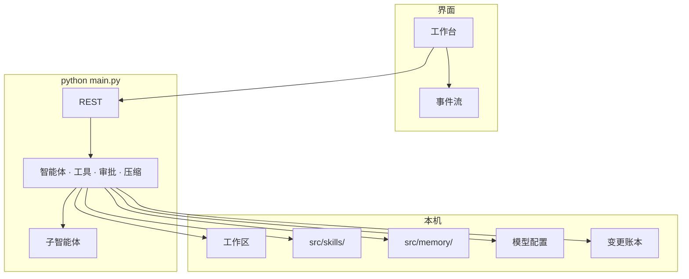

# Sidekick — 本地多智能体工作台

[English](README.en.md)

同一套工作区，主智能体调度、子智能体执行。  
每一处改动都能确认、审计、撤销、重放。

**Windows · macOS · Linux** · 默认 **http://127.0.0.1:8787**

---

## 概览

Sidekick 不是聊天窗口，而是跑在你本机上的智能协作团队：打开任意文件夹，主智能体拆解任务，子智能体搜索、阅读、编辑文件。写入、删除、命令行等变更默认先经过你确认。

同一条运行回路覆盖网页工作台与桌面端：工具调度、审批、压缩、子智能体画板行为一致。Skill 按目录即插即用，记忆库留在本地，模型走你自己的兼容接口（Base URL + API Key + 模型名）。

---

## 界面预览

<p align="center">
  
</p>
<p align="center">
  
</p>

---

## 安装

Sidekick 可在 Windows、macOS、Linux 上运行。按用途选一条路径即可。

| 路径 | 适用 | 何时使用 |
| --- | --- | --- |
| [快速启动](#快速启动) **（推荐）** | 日常使用 | 本机已有 Python，一条命令跑起来 |
| [桌面应用](#桌面应用) | 需要侧栏预览网页、点选元素 | 双击脚本即可 |
| [从源码开发](#从源码开发) | 改界面、加工具、加 Skill | 同时跑后端与前端热更新 |
| [Windows 离线安装包](#windows-离线安装包) | 无开发环境的目标机 | 在联网开发机打包后拷走 |

### 环境要求

| 要求 | 快速启动 | 桌面应用 | 从源码开发 | 离线安装包 |
| --- | :---: | :---: | :---: | :---: |
| Python 3.10+ | 需要 | 需要 | 需要 | 打包机需要 |
| Node.js 18+ | — | 脚本会处理 | 改 UI 时需要 | 打包机需要 |

### 快速启动

**Windows PowerShell**

```powershell
cd path\to\Sidekick
python -m pip install -r requirements.txt
python main.py
```

或双击 **`start.bat`**（不必设置 `PYTHONPATH`）。

**macOS / Linux**

```bash
cd /path/to/Sidekick
python3 -m pip install -r requirements.txt
python3 main.py
```

打开 **http://127.0.0.1:8787** → 选择工作区文件夹 → 设置 → 模型 → 填入兼容接口的 Base URL、API Key 与模型名。

也可复制 `src/data/model.json.example` → `src/data/model.json` 后再改。

> [!NOTE]
> 不要提交真实密钥、`.env`、会话记录或 `model.json`（见 `.gitignore`）。

### 桌面应用

日常使用推荐桌面端：侧栏可预览本地页面，支持交互与点选。

双击 **`start-desktop.bat`** 会安装依赖并启动桌面窗口。

```powershell
.\start-desktop.bat
```

浏览器沙盒需要一次性准备 Chromium：

```bash
pip install playwright
playwright install chromium
```

说明见 [docs/browser-sandbox.md](docs/browser-sandbox.md)。

### 从源码开发

改界面或调试前端时，后端与 UI 分开跑：

```powershell
python main.py
```

```powershell
cd ui
npm i
npm run dev          # 热更新
# npm run build      # 构建后可由后端托管静态页
```

### Windows 离线安装包

在一台能联网的 Windows 开发机上打包，再把安装程序拷到目标机：

```powershell
.\scripts\build-windows.bat
```

说明见 [packaging/windows/README.md](packaging/windows/README.md)。

---

## 配置

### 首次设置

1. 选定本机工作区文件夹（代码库、文档、日志均可）。
2. 在设置里配置主模型、子智能体模型、压缩模型（可指向不同接口与价位）。
3. 需要浏览器能力时安装 Chromium（见上）。

主模型处理对话与规划，子智能体跑委派任务，压缩模型在上下文将满时摘要。密钥写在本机 `model.json`，落盘时加密。

### 本机安全（默认）

- 仅绑定 `127.0.0.1`；绑定到非本机地址需显式 `META_ALLOW_REMOTE=1`（不安全）。
- API 需要本地令牌；界面经 `/api/bootstrap` 自动获取。
- `model.json` 中的密钥使用本机密钥加密存储。
- Shell 工具默认开启，仍走审批门；设 `META_ALLOW_SHELL=0` 可完全关闭。

### 运行

```powershell
python main.py                 # 前台，127.0.0.1:8787
.\start.bat                    # Windows 一键
.\start-desktop.bat            # 桌面窗口
```

浏览器打开 **http://127.0.0.1:8787**。前台进程用 `Ctrl+C` 结束。

斜杠命令：`/help` · `/new` · `/clear` · `/skills` · `/skill <名称>` · `/memory` · `/history` · `/browser` · `/stop`

---

## 核心能力

| 能力 | 做什么 |
| --- | --- |
| **多智能体协作** | 主智能体拆解与调度；子智能体执行搜索、阅读、编辑。多方对话与对抗以人物画板呈现，发言在角色之间传递，点击人物查看详情。 |
| **可控变更账本** | 写入类工具先确认。时间线记录谁（主/子）改了什么、为何改；可按轮或按文件一键回滚，也可从某次确认点重放计划。 |
| **本地工作区** | 打开本机文件夹即可对话。创建 / 重命名 / 删除（需确认）/ 拖拽移动；按文件名与内容搜索，并跳到对应行。 |
| **Skill 即插即用** | 把目录丢进 `src/skills/`，对话里用 `/skill 名称` 调用。不必改核心代码。 |
| **长期记忆** | 分类记忆库；可选择下一轮注入哪些笔记，减少重复说明。 |
| **上下文压缩** | 窗口将满时压缩；Skill 按需调用，而不是每轮粘贴整份说明。重活给强模型，委派与压缩可走更省的模型。 |
| **审批与安全** | 写文件、删除、命令行、记忆写入等先暂停等你决定。默认只监听本机。 |
| **浏览器沙盒** | 预览本地页面；点选模式把元素送进对话；智能体可调用 `browser_*` 工具。 |
| **会话与重放** | 流式对话、附件、停止、编辑后重发（可选把文件恢复到那一步）。历史分页，中/英与浅/深色。 |

---

## 架构



```
Sidekick/
├── src/metateam/     # 核心：API、智能体、工具
├── src/skills/       # 可丢入的 Skills
├── src/memory/       # 记忆库（本地，不提交用户内容）
├── src/data/         # model.json.example（无密钥）
├── src/sessions/     # 会话（本地，不提交）
├── src/workspace/    # 默认工作区占位
├── ui/               # 控制界面
├── desktop/          # 桌面端
├── packaging/windows/# 离线安装包说明
├── scripts/
├── docs/
├── main.py
├── start.bat
├── start-desktop.bat
├── requirements.txt
└── README.md
```

---

## 二次开发

- **加 Skill**：目录丢进 `src/skills/`，对话里 `/skill 名称`
- **加工具**：在 `src/metateam/runtime/tools/` 注册函数即可被智能体调用
- **改界面**：`ui/src/`，样式在 `ui/src/styles/app.css`（不必改后端）
- **接模型**：任意兼容接口（Base URL + API Key + 模型名）

欢迎提交缺陷、功能想法、文档与运行时改动。
