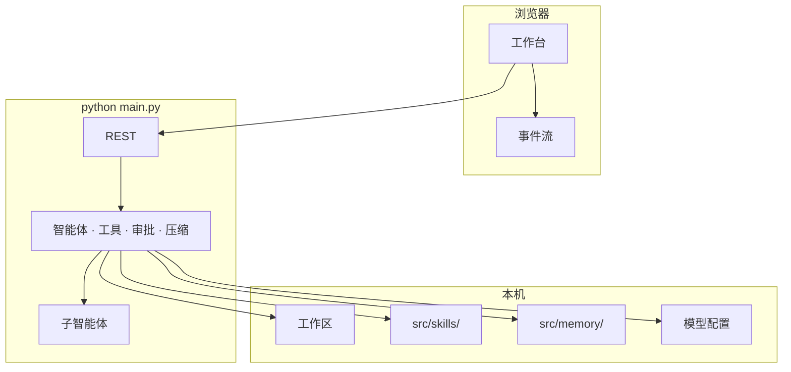

# Sidekick

**Sidekick** 不是一个聊天机器人，而是一个 **真正属于你本地文件系统的智能协作团队**。  
它由主智能体与子智能体协同工作，帮你搜索、阅读、编辑文件。

---

## 核心亮点

### 多智能体协作，而非单点对话
- 主智能体负责任务拆解与调度
- 子智能体专注执行具体动作（搜索、读取、编辑）
- 你始终在决策链中，**变更需确认**，可控且透明

### 本地优先，开箱即用
- 打开任意本机文件夹，浏览器内即可对话
- 无需上传云端，数据不出设备
- 适合处理代码库、文档、日志等敏感或大规模内容

### Skill 即插即用，目录即能力
- 新增 Skill 只需丢进目录，无需修改核心代码
- 支持自定义工具注册，快速适配私有工作流
- 真正为**二次开发**设计，不硬啃黑盒

### 长期记忆，越用越懂你
- Memory 机制可长期存储偏好、上下文与决策习惯
- 跨会话保持一致性，减少重复说明


---

## 界面预览


---

## 快速开始

**环境：** Python 3.10+ · Node.js 18+（仅 UI 需要）

### Windows PowerShell

```powershell
cd path\to\Sidekick
python -m pip install -r requirements.txt
python main.py
```

或双击 **`start.bat`**（无需设置 `PYTHONPATH`）。

### macOS / Linux

```bash
cd /path/to/Sidekick
python3 -m pip install -r requirements.txt
python3 main.py
```

打开 **http://127.0.0.1:8787** → 选工作区文件夹 → 设置 → 模型 → 填入兼容 OpenAI 的 Base URL 与 API Key。

也可复制 `src/data/model.json.example` → `src/data/model.json`。

### 桌面应用

日常使用推荐桌面端：侧栏可预览本地页面，支持交互与点选。

双击 **`start-desktop.bat`** 会自动安装依赖并启动 Electron。

```powershell
.\start-desktop.bat
```

浏览器沙盒依赖 Playwright Chromium（一次性）：

```bash
pip install playwright
playwright install chromium
```

### Windows 离线安装包（.exe）

在一台能联网的 Windows 开发机上打包，再把安装程序拷到目标机：

```powershell
.\scripts\build-windows.bat
```

> 切勿提交真实 Key、`.env`、会话或 `model.json`（见 `.gitignore`）。

### 本机安全（默认）

- 仅绑定 `127.0.0.1`；非本机绑定需显式 `META_ALLOW_REMOTE=1`（不安全）。
- API 需本地令牌；UI 经 `/api/bootstrap` 自动获取。
- `model.json` 中的 API Key 使用本机密钥加密存储。
- Shell 工具默认开启，仍走审批门；设 `META_ALLOW_SHELL=0` 可完全关闭。

### UI（可选）

```powershell
cd ui
npm i
npm run dev          # 热更新
# npm run build      # 构建后只跑后端即可托管静态页
```

### 斜杠命令

`/help` · `/new` · `/clear` · `/skills` · `/skill <名称>` · `/memory` · `/history` · `/browser` · `/stop`

### 二开入口

- **加 Skill**：把目录丢进 `src/skills/`，对话里用 `/skill 名称` 调用
- **加工具**：在 `src/metateam/runtime/tools/` 注册函数即可被智能体调用
- **改界面**：`ui/src/`，样式在 `ui/src/styles/app.css`（不必改后端）
- **接模型**：任意 OpenAI 兼容网关（Base URL + API Key + 模型名）

---

## 架构



```
Sidekick/
├── src/metateam/     # 核心：API、智能体、工具
├── src/skills/       # 可丢入的 Skills
├── src/memory/       # 记忆库（本地，不提交用户内容）
├── src/data/         # model.json.example（无密钥）
├── src/sessions/     # 会话（本地，不提交）
├── src/workspace/    # 默认工作区占位
├── ui/               # Vite 控制界面
├── desktop/          # Electron 桌面端
├── packaging/windows/# 离线安装包说明
├── scripts/
├── docs/
├── main.py
├── start.bat
├── start-desktop.bat
├── requirements.txt
└── README.md
```

欢迎 Fork、改界面、加 Skills，做成自己的多智能体工作台。
